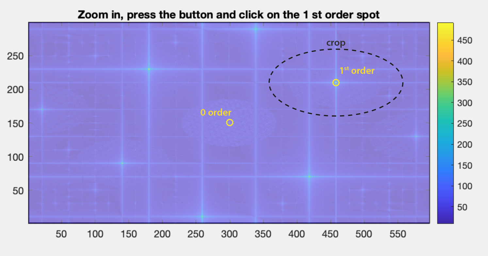

# CGMprocess
<h1>Matlab algorithm to process QLSI interferograms into intensity and wavefront (phase) images</h1>
<h2><i>Quantitative phase microscopy using quadriwave lateral shearing interferometry (QLSI): principle, terminology, algorithm and grating shadow description. 
G. Baffou, J. Phys. D: Appl. Phys. 54, 294002 (2021)</i></h2>
<a href="https://iopscience.iop.org/article/10.1088/1361-6463/abfbf9/pdf" target="_blank">journal</a>&nbsp;&nbsp;&nbsp;—&nbsp;&nbsp;&nbsp; 
<a href="http://guillaume.baffou.com/publications/053-Baffou-JPhysD.pdf" target="_blank">pdf</a>

<h3>Introduction</h3>

<b>Cross-grating phase microscopy</b> (CGMs) is a wavefront sensing technique that can be used as a high-resolution, highly sensitive quantitative phase microscopy technique. It is based on the simple association of a regular camera and a 2D diffraction grating (aka cross-grating) separated by a millimetric distance <a href="http://guillaume.baffou.com/publications/053-Baffou-JPhysD.pdf" target="_blank">[1]</a>. The cross-grating creates a so-called interferogram image that is processed to retrieve both the intensity and the phase of the incoming light beam.

The popular instance of CGM is called <b>quadriwave lateral shearing interferometry</b>, invented and patented by J. Primot et al. in 2000 <a href="https://opg.optica.org/ao/abstract.cfm?uri=ao-39-31-5715" target="_blank">[2]</a>. It use a diffraction grating consisting of 0-pi checkerboard phase pattern.

This algorithm retrieves the intensity and wavefront profiles from a QLSI interferogram, from the sole knowledge of:
<ul><li>The QLSI grating period</li>
  <li>the camera pixel size (that we call the dexel size)</li>
  <li>the grating-camera distance</li>
  </ul>

The processing is automatic, except for one step, the selection of the first order of diffraction, in the Fourier space. The user has to click on it, and then close the window. Here is what a first order looks like:

This code is associated with this article:
<i>Quantitative phase microscopy using quadriwave lateral shearing interferometry (QLSI): principle, terminology, algorithm and grating shadow description. 
G. Baffou, J. Phys. D: Appl. Phys. 54, 294002 (2021)</i>

Enjoy!

